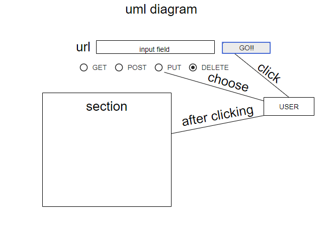

# resty

# resty : 

# Component Based UI :

Component based UI systems like React, Angular, Vue and the like all operate on a variation of "Atomic Design", using "Components" as the means of delivery.

"Thinking in React" means re-evaluating how you look at a web application: Breaking down it's functional parts, data dependencies, behaviors, and styles into independent, deliverable, re-usable components.

Learning Objectives

# dependencies : 

            npm i sass
            npm i scss
            npm i node-sass

# Run the app : 
                
                npm start

## UML Diagram : 

